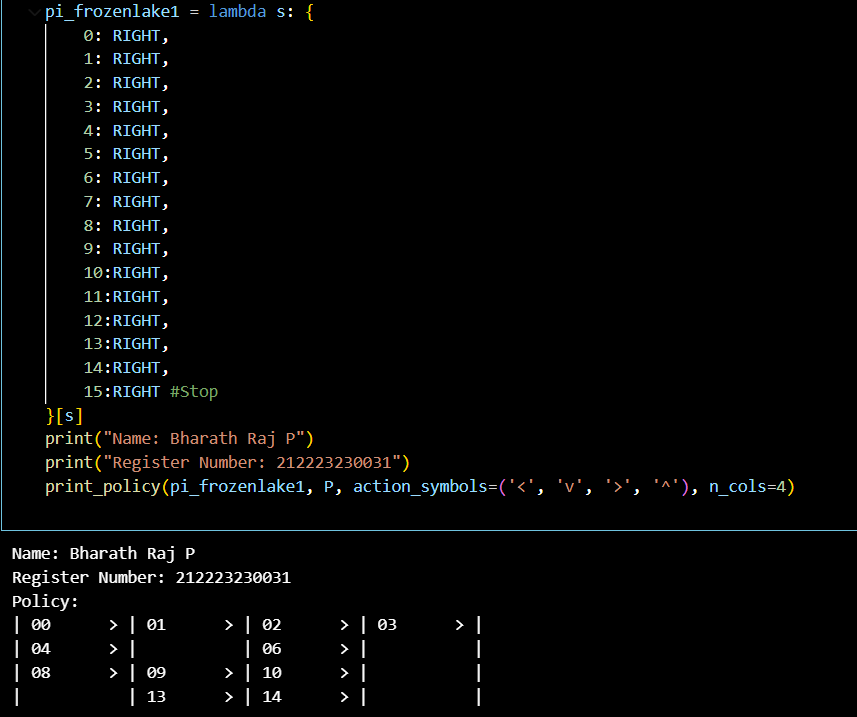

# POLICY ITERATION ALGORITHM

## AIM
The aim of this experiment is to implement the **Policy Iteration Algorithm** in Reinforcement Learning to determine the optimal policy and corresponding value function for a given environment. Policy Iteration combines iterative **policy evaluation** and **policy improvement** steps to achieve convergence towards an optimal policy.

## PROBLEM STATEMENT
In Reinforcement Learning, the agent interacts with an environment modeled as a Markov Decision Process (MDP).  
The challenge is to find an **optimal policy** that maximizes the long-term cumulative reward.  
Policy Iteration addresses this by:
1. Evaluating the value of a given policy (Policy Evaluation).
2. Improving the policy based on the evaluated value function (Policy Improvement).
3. Repeating these steps until the policy converges to the optimal policy.

## POLICY ITERATION ALGORITHM
The steps involved in the **Policy Iteration Algorithm** are:

1. **Initialization**  
   - Initialize an arbitrary policy π and value function V(s).

2. **Policy Evaluation**  
   - For the current policy π, compute the value function V(s) for all states until convergence.

3. **Policy Improvement**  
   - Update the policy by choosing actions that maximize the expected return using the current value function.

4. **Check for Convergence**  
   - If the policy does not change (π′ = π), then the policy is optimal and the algorithm terminates.
   - Otherwise, repeat steps 2 and 3.

## POLICY IMPROVEMENT FUNCTION
### Name : Bharath Raj P
### Register Number : 212223230031

```python
def policy_improvement(V, P, gamma=1.0):
    Q = np.zeros((len(P), len(P[0])), dtype=np.float64)

    for s in range(len(P)):
        for a in range(len(P[s])):
            for prob, next_state, reward, done in P[s][a]:
                Q[s][a] += prob * (reward + gamma * V[next_state] * (not done))

    new_pi = lambda s: {s: a for s, a in enumerate(np.argmax(Q, axis=1))}[s]

    return new_pi
```

## OUTPUT
### 1. Policy, Value function and success rate for the Adversarial Policy



### 2. Policy, Value function and success rate for the Improved Policy


### 3. Policy, Value function and success rate after policy iteration


## RESULT
The Policy Iteration Algorithm was implemented successfully. The results show that the adversarial policy performed poorly, the improved policy achieved a better success rate, and the final policy after iteration converged to the optimal solution with maximum success rate.
